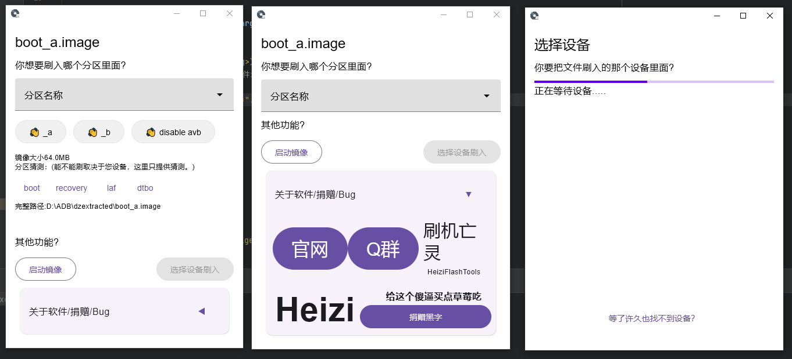

# Heizi Flash Tools
它有很多名字，你可以选择其中之一来称呼这一套工具。
* HFT
* 刷级亡灵
* 黑字刷机工具箱
* Heizi Flash Tools

> 注意：有用户反馈360会阻断该软件的IO，请退出各种管家软件再运行本软件。

点击访问[官网](https://tools.lge.fun)（Github pages）获得更好的体验。

## 什么是HFT？
### 通过视频快速预览该软件的魅力：
这是一个刷TWRP的视频，如果您熟悉这个操作应该会感到惊讶：  
* https://www.bilibili.com/video/BV1LS4y1G7b9  
<iframe src="//player.bilibili.com/player.html?aid=681350963&bvid=BV1LS4y1G7b9&cid=503446219&page=1" scrolling="no" border="0" frameborder="no" framespacing="0" allowfullscreen="true"> </iframe>
  

### 简单的来说
我开发了**一堆** (~~现在也就三个~~)零碎的、功能上互不相干的、各司其职的 刷机工具，准备开发更多的来组成了一个**刷机全家桶**。
> 对 黑字刷机全家桶。
### 理念上来说
围绕ADB和Fastboot做GUI处理，致力于可高度扩展、**可下意识使用的刷机软件**(这点很重要)，以友好易用的方式连结小白和大佬。
> f**k the manual  
> 看一眼！直接上手！！！

## 都有几个刷机工具？
以后或许会更新更多，但是现在只有三个，分别是Fastboot设备管理工具、镜像刷入工具，安卓线载工具。
### FFT - Fastboot设备管理工具 - **F**astboot **F**lash **T**ool 
   
FFT基于Fastboot指令发展而来，在此之上实现了比较人性化的界面，同时针对不同的设备进行优化处理。所以你可以大胆的扔掉指令和黑色的垃圾CMD窗口，借助这个美丽的图形界面，进行切换AB分区、重启、查看详细信息和进行分区管理操作。  
>状态: 完全可用

### IFT - 分区镜像刷入工具 **I**mage **F**lash **T**ool  
  
你可以使用这个工具打开一个Boot镜像、System、Vbmeta分区镜像等，按照图形界面上的帮助，进行您的安装操作。例如你要刷whyred_twrp_recovery.img这个红米的twrp，不需要打开什么软件、cmd，直接双击文件，别告诉我你看不懂这个是啥意思。
* 使用视频：【刷机工具】LG V60 一键刷TWRP | https://www.bilibili.com/video/BV1LS4y1G7b9  
> 状态: 完全可用
### AST - 安卓线载工具 Apk/Sideload Tool

IFT，但打开的是安装包和刷机包。
> 状态: 第一个版本正在发行中。

### 更多还在脑海中... 如：
* ADB管理器工具
* 指令执行器
* QPST Alike

### 更多HFT使用教程：

* https://www.bilibili.com/video/BV1y3411j7xK  
<iframe src="//player.bilibili.com/player.html?aid=423897399&bvid=BV1y3411j7xK&cid=507144254&page=1" scrolling="no" border="0" frameborder="no" framespacing="0" allowfullscreen="true"> </iframe>      

* https://www.bilibili.com/video/BV18Y4y157R1  
<iframe src="//player.bilibili.com/player.html?aid=641789961&bvid=BV18Y4y157R1&cid=727635765&page=1" scrolling="no" border="0" frameborder="no" framespacing="0" allowfullscreen="true"> </iframe>  

### 使用了该软件的教程：

* LG-V50/V50S/G8X保姆级食用安卓12教程  
  https://www.coolapk.com/feed/38297082?shareKey=NzEwZDliN2Y2NGQyNjMxNjE5MDU~&shareUid=3174533&shareFrom=com.coolapk.market_12.4.2
* LG V60 解BL教程  
  https://bbs.lge.fun/thread-2551.htm
* LG V60三十秒刷TWRP  
  https://www.bilibili.com/video/BV1LS4y1G7b9

### 最新版本：0.0.8
下载地址：任选其一
* https://github.com/ElisaMin/Heizi-Flashing-Tools/releases
* HFT(刷机亡灵)交流群   
  https://jq.qq.com/?_wv=1027&k=NEzVueGC  
  549674080
* https://dl.lge.fun/HeiziFlashTools/

# 对于开发者/功能讨论
本项目遵循GPLv3开源协议。
## 如果有任何建议、Bug：
可以选择加入群聊进行讨论也可以开设Issue讨论。
* 549674080  
  https://jq.qq.com/?_wv=1027&k=NEzVueGC
## sub - modules
开发者可以看看这里有多少个子模块

* tools/Image Flash Tool (IFT)
* tools/Fake Fastboot Device (FFT)
* ADB Sideload Tool (AST)  
  积极开发中...  

* libs/ADB-Helper
* libs/compose.desktop.core  
  用于Compose扩展
    * 本来有Compose的[Fragment](https://github.com/ElisaMin/Heizi-Flashing-Tools/tree/fragment) 实现，但现在替换成了[Decompose](https://github.com/arkivanov/Decompose) 就把Fragment删了。#2
* libs/Native File Dialog  
  call native file dialog by jna

## Why HFT? HFT的构思以及形成的原因 
长期以来，大家都在用CLI刷机，在熟悉操作后实际上你会发现CLI是非常简便的，Fastboot基本上都是**大白话**的指令，不用脑子思考就能`表达`一个`需求`，各种教程也在教授这种刷机方式，教他们怎么打开CMD什么的。
> 指令: fastboot flash boot_a bootImage  
> 翻译: fb模式     刷   启动分区A槽 文件路径

Well，有点小聪明的人们会很快就上手，就像是连线一样，把`我要给手机用这个文件刷BootA分区`重新解释并套进`fastboot [command] [args1] [args2] `模板中。但对于没那么聪明的大部分来说，你一定会知道整个过程非常繁琐，首先你需要打开一个终端 确保这个终端可以找到Fastboot.exe，然后输入fastboot 和一些别的指令，偶尔刷一次是可以的，但是多次刷入非常难受。

### Batch脚本
LG G5，我的第一台LG设备，型号为H830，Root它需要借助AndroidM的DirtyCow漏洞，所以要执行一堆复杂的指令代码才能Root，每次砖了就得刷一次固件、执行几个步骤的代码，但我们并不需要执行那么多代码，因为XDA论坛上公布了一个为此而生的脚本，非常精美。一个Batch脚本能检测设备是什么机型，并且让用户自行选择是仅仅安装SU还是连Rec一起刷入。在无聊之际，我翻译了这个全是英文的脚本，也因此得学，制作了一个非常经典的工具脚本。
> * 项目地址 https://github.com/ElisaMin/LGG7-batch-Scripts
    

这里面简化了很多操作，使用键盘来完成交互式选择模式也让很多的刷机小白感受到熟悉。将你至于用户的位置，在打开后，选择2会跳转到另外一个界面，它自动检测你的设备是否插入，在检测到后让你把文件拖进窗口内，这一切都非常自然。

**对比来说，它更加拟人化，也因此被广泛流传。**

### 图形化
在尝到甜头后，我希望一个软件能更加亲近人类多一点，开始了对鼠标操作的探索。

#### Swing Version (Heizi Tool)
第一次尝试： 总的来说，它是失败的。
> * 项目地址 https://github.com/ElisaMin/kotlin-swing-dsl-and-simple
   

在无聊之际思考着怎么把fastboot的xxx功能应该怎么通过图形化展现出来，得到了这个看起来云里雾里的界面。视角至于指令拼接中。在此，Fastboot得到了直白的图形化展示，并没有多人性化，就像是没有毛、耳朵、皮肤，甚至肛门装摄像头的电子猫宠物，它的确实现了猫的抽象价值，能跑能运行，但爱谁谁买去。  
而且文件选择器非常难用，每次都得疯狂的找，即使是作为开发者的我 也没有怎么使用这个软件。
> 如果你发现那个软件的文件选择器长这个样子那么一定是用Java开发的。
  
记得小时候就用过这玩意，也是觉得像屎一样。  

**这就有了进步空间。**

#### HFT
总结后，我对刷机方式进行了新的思考（又是闲暇时间的瞎想~）。  
**如果，我是说如果，它不是抽象一个Fastboot而是一个设备呢？或者抽象一个镜像，重新定义一种刷机方式。像是双击就能安装进设备里面！**   
  
所以这次我改变了逻辑，现在的刷机工具更像是一个文件编辑器，使用逻辑是你打开一个文件 处理这个文件，然后拔＊无情。基本上有过一定软件使用经验的人，都能做到下意识使用这款软件，因为这就像是你在打开某个图片音乐，然后浏览内容。     

# 感谢Jetbrains送的JB全家桶
本项目由IDEA开发，并取得了Jetbrains OpenSourceLicense

